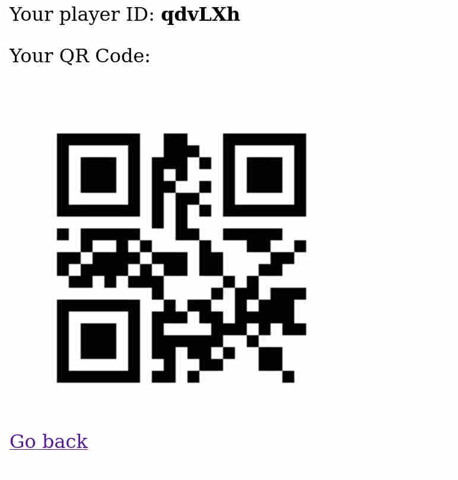
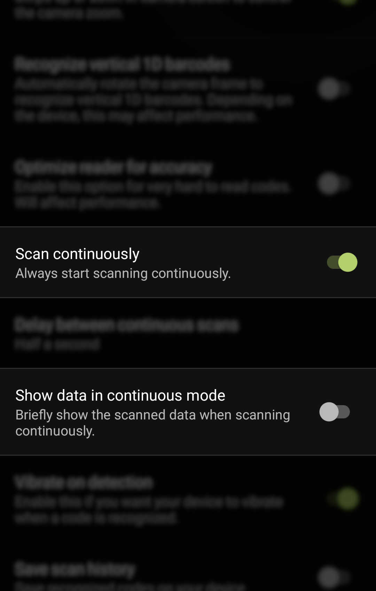
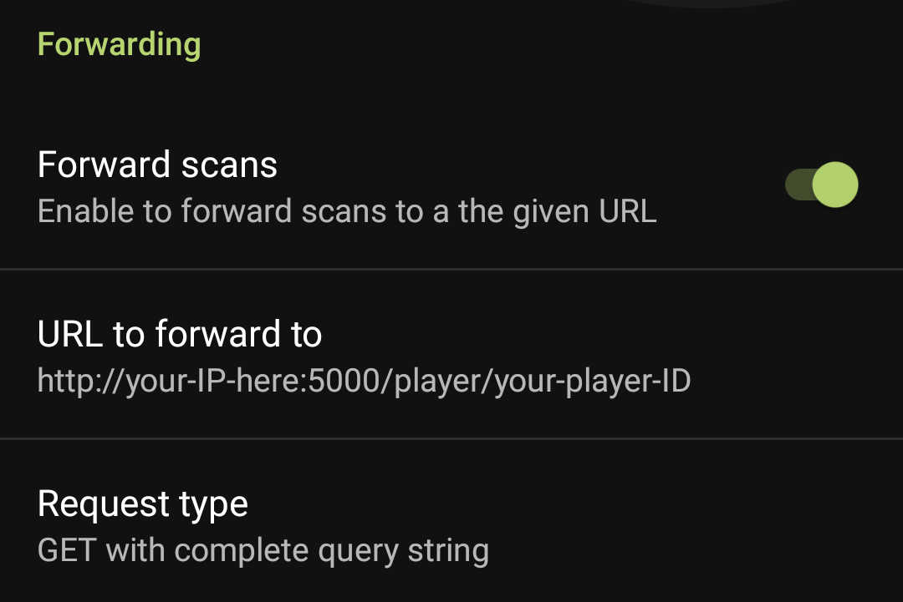

## QRCatch

A real-life game, where your objective is to scan others player's QR Codes using your phone. Inspired by some random Reddit comment which I couldn't find again.

-----

## Setup

#### On the server

Install the required modules from `requirements.txt`, then run `main.py`.

#### For every player

This game uses the [Binary Eye](https://github.com/markusfisch/BinaryEye) app on your smart phone, download it using your preferred method.

Go to [http://yourServerIP:5000/](http://localhost:5000/) and click on `Register a new player`.

Input your username and click on `Register`.

You should see a screen like this.

Save the QR Code and **print it**.

Then go to your phone and open up Binary Eye and go to `Preferences`.

Make changes to the settings according to the screenshots above.

Under `URL to forward to` set the URL in the following format:

http://`Your server's IP`:5000/player/`Your player ID`

**Make sure Binary Eye doesn't append `?content=` to your value**.

Once ready to play, tape your printed QR Code to your back.

## Creating a game

Go to [http://yourServerIP:5000/](http://localhost:5000/) on any device and click on `Start a game`.

A QR Code will be automatically generated for you. 

To join a game, simply scan the QR Code with your device. You should instantly appear on the leaderboard. 

Once two or more players join the game begins.

## Playing the game

The game is extremely simple.

Scan other player's QR Codes to gain kills.

Avoid getting your code scanned while scanning others, stay safe and try not to get hurt.
